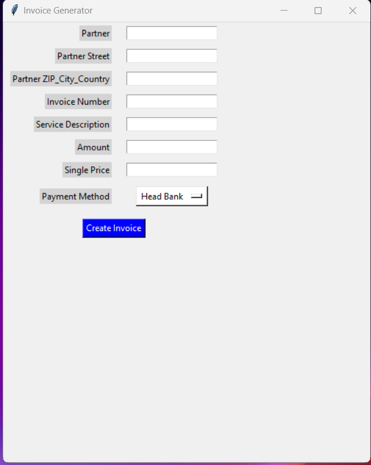

# Invoice Generator

## Overview

Invoice Generator is a Python-based application that allows users to create professional invoices quickly and easily. The application features a user-friendly GUI built with Tkinter and leverages the `python-docx` and `docx2pdf` libraries to generate and convert Word documents to PDF.

## Features

- **User-friendly Interface**: Simple and intuitive GUI for entering invoice details.
- **Customizable Payment Methods**: Supports multiple predefined payment methods.
- **Dynamic Invoice Creation**: Automatically fills in invoice details based on user input.
- **PDF Conversion**: Converts generated Word invoices to PDF format for easy sharing and printing.

## Screenshots



## Installation

1. **Clone the Repository**:
   ```bash
   git clone https://github.com/yourusername/invoice-generator.git
   cd invoice-generator
   ```

2. **Create a Virtual Environment** (Optional but recommended):
   ```bash
   python -m venv venv
   source venv/bin/activate   # On Windows, use `venv\Scripts\activate`
   ```

3. **Install Dependencies**:
   ```bash
   pip install -r requirements.txt
   ```

## Dependencies

- `python-docx`: For creating and editing Word documents.
- `docx2pdf`: For converting Word documents to PDF.
- `tkinter`: For the graphical user interface.

You can install these dependencies via `pip`:
```bash
pip install python-docx docx2pdf tk
```

## Usage

1. **Run the Application**:
   ```bash
   python invoice_generator.py
   ```

2. **Fill in the Details**:
   - Enter the partner details, invoice number, service description, amount, and price.
   - Select a payment method from the dropdown menu.

3. **Generate Invoice**:
   - Click the "Create Invoice" button to generate and save the invoice as a PDF.

## Project Structure

- `invoice_generator.py`: The main script containing the application logic.
- `template.docx`: The Word template used for generating invoices.
- `requirements.txt`: List of dependencies required for the project.

## Contributing

Contributions are welcome! If you have suggestions for improvements or find any bugs, please open an issue or submit a pull request.
